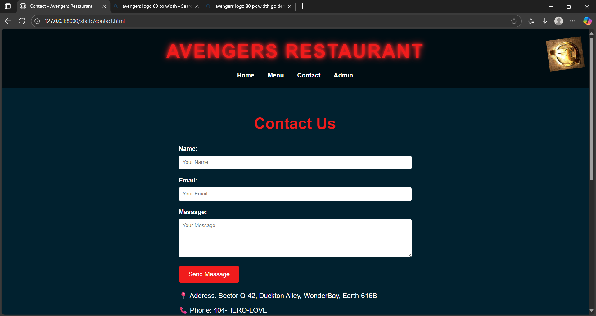

# Ex.07 Restaurant Website
## Date:01.10.2025

## AIM:
To develop a static Restaurant website to display the food items and services provided by them.

## DESIGN STEPS:

### Step 1:
Requirement collection.

### Step 2:
Creating the layout using HTML and CSS.

### Step 3:
Updating the sample content.

### Step 4:
Choose the appropriate style and color scheme.

### Step 5:
Validate the layout in various browsers.

### Step 6:
Validate the HTML code.

### Step 7:
Publish the website in the given URL.

## PROGRAM:
```
CSS
style.css
/* General Reset */
* {
    margin: 0;
    padding: 0;
    box-sizing: border-box;
    font-family: 'Arial', sans-serif;
}

body {
    background-color: #01212f;
    color: #fff;
    line-height: 1.6;
}

/* Header & Navigation */
header {
    background: url('images/cityscape.png.jpg') center/cover no-repeat;
    padding: 20px 0;
    text-align: center;
    position: relative;
}

header::after {
    content: "";
    position: absolute;
    top:0; left:0; width:100%; height:100%;
    background: rgba(0,0,0,0.6);
}

header h1 {
    font-size: 3rem;
    color: #f01c1c;
    text-transform: uppercase;
    letter-spacing: 3px;
    position: relative;
    z-index: 1;
    animation: glow 2s infinite alternate;
}

@keyframes glow {
    0% { text-shadow: 0 0 5px #f01c1c, 0 0 10px #f01c1c;}
    100% { text-shadow: 0 0 20px #ff3b3b, 0 0 40px #ff3b3b;}
}

nav {
    margin-top: 10px;
    position: relative;
    z-index: 1;
}

nav a {
    color: #fff;
    text-decoration: none;
    margin: 0 15px;
    font-weight: bold;
    transition: 0.3s;
}

nav a:hover {
    color: #f01c1c;
}

/* Avengers Logo Animation */
.avengers-logo {
    width: 80px;
    position: absolute;
    top: 20px;
    right: 20px;
    z-index: 2;
    animation: rotate 5s linear infinite;
}

@keyframes rotate {
    0% { transform: rotate(0deg);}
    100% { transform: rotate(360deg);}
}

/* Banner */
.banner {
    width: 100%;
    height: 500px;
    background: url('images/banner.png.png') center/cover no-repeat;
    display: flex;
    align-items: center;
    justify-content: center;
    text-align: center;
}

.banner h2 {
    font-size: 4rem;
    color: #fff;
    text-shadow: 2px 2px 10px #000;
}

/* Sections */
section {
    padding: 60px 20px;
    text-align: center;
}

section h2 {
    font-size: 2.5rem;
    margin-bottom: 20px;
    color: #f01c1c;
}

section p {
    max-width: 800px;
    margin: 0 auto 40px;
    font-size: 1.1rem;
}

/* Menu Grid */
.menu-grid {
    display: grid;
    grid-template-columns: repeat(auto-fit, minmax(200px, 1fr));
    gap: 30px;
    margin-top: 30px;
}

.menu-grid img {
    width: 100%;
    border-radius: 10px;
    transition: transform 0.3s;
}

.menu-grid img:hover {
    transform: scale(1.05);
}

/* Staff Grid */
.staff-grid {
    display: grid;
    grid-template-columns: repeat(auto-fit, minmax(150px, 1fr));
    gap: 20px;
    margin-top: 30px;
}

.staff-grid img {
    width: 100%;
    border-radius: 50%;
    border: 3px solid #f01c1c;
}

/* Contact Form */
.contact-form {
    max-width: 600px;
    margin: 0 auto;
    text-align: left;
}

.contact-form label {
    display: block;
    margin-bottom: 5px;
    font-weight: bold;
}

.contact-form input,
.contact-form textarea {
    width: 100%;
    padding: 10px;
    margin-bottom: 15px;
    border: none;
    border-radius: 5px;
}

.contact-form button {
    background-color: #f01c1c;
    color: #fff;
    padding: 12px 25px;
    border: none;
    border-radius: 5px;
    cursor: pointer;
    font-size: 1rem;
    transition: 0.3s;
}

.contact-form button:hover {
    background-color: #ff3b3b;
}

/* Map Image */
.map-image {
    width: 100%;
    max-width: 600px;
    margin: 20px auto;
    border-radius: 10px;
}

/* Extra Contact Info */
.contact-info {
    max-width: 600px;
    margin: 20px auto;
    text-align: left;
    font-size: 1.1rem;
}

.contact-info p {
    margin-bottom: 10px;
}

/* Footer */
footer {
    background: url('images/cityscape.png.jpg') center/cover no-repeat;
    text-align: center;
    padding: 20px 0;
    margin-top: 40px;
    border-top: 2px solid #f01c1c;
    position: relative;
}

footer::after {
    content: "";
    position: absolute;
    top:0; left:0; width:100%; height:100%;
    background: rgba(0,0,0,0.7);
}

footer p {
    color: #fff;
    font-weight: bold;
    position: relative;
    z-index: 1;
}
/* Admin Page */
.admin {
  padding: 40px;
  text-align: center;
}

.admin h1 {
  color: yellow;
  margin-bottom: 20px;
}

.admin-grid {
  display: grid;
  grid-template-columns: repeat(2, 1fr);
  gap: 30px;
  margin-top: 30px;
}

.admin-card {
  background: #1a1a1a;
  border: 2px solid red;
  border-radius: 10px;
  padding: 20px;
  color: white;
  box-shadow: 0 0 10px red;
}

.admin-card h2 {
  color: red;
  margin-bottom: 15px;
}

.highlight {
  color: yellow;
  font-weight: bold;
}

.map {
  width: 100%;
  border-radius: 10px;
  border: 2px solid yellow;
  margin-top: 10px;
}

admin.html

<!DOCTYPE html>
<html lang="en">
<head>
  <meta charset="UTF-8">
  <title>Admin - Avengers Restaurant</title>
  <link rel="stylesheet" href="css/style.css">
</head>
<body>
  <header>
    <nav>
      <a href="index.html">Home</a>
      <a href="menu.html">Menu</a>
      <a href="admin.html">Admin</a>
      <a href="contact.html">Contact</a>
    </nav>
  </header>
  

  <section class="admin">
    <h1>Avengers Restaurant Admin Panel</h1>
    <p>Welcome, Admin! Here you can manage the restaurant operations.</p>

    <div class="admin-grid">
      <!-- Orders Section -->
      <div class="admin-card">
        <h2>📦 Orders</h2>
        <p>Today’s Orders: <span class="highlight">25</span></p>
        <p>Pending Deliveries: <span class="highlight">5</span></p>
      </div>

      <!-- Staff Section -->
      <div class="admin-card">
        <h2>👨‍🍳 Staff</h2>
        <p>Total Staff: <span class="highlight">6</span></p>
        <p>On Duty: <span class="highlight">4</span></p>
      </div>

      <!-- Revenue Section -->
      <div class="admin-card">
        <h2>💰 Revenue</h2>
        <p>Today’s Revenue: <span class="highlight">₹15,000</span></p>
        <p>This Month: <span class="highlight">₹3,20,000</span></p>
      </div>

      <!-- Location Section -->
      <div class="admin-card">
        <h2>📍 Location</h2>
        
      </div>
    </div>
  </section>

  <footer>
    <p>Designed by Ritika🤍</p>
  </footer>
</body>
</html>

contact.html

<!DOCTYPE html>
<html lang="en">
<head>
<meta charset="UTF-8">
<meta name="viewport" content="width=device-width, initial-scale=1.0">
<title>Contact - Avengers Restaurant</title>
<link rel="stylesheet" href="css/style.css">
</head>
<body>

<header>
<h1>Avengers Restaurant</h1>

<nav>
<a href="index.html">Home</a>
<a href="menu.html">Menu</a>
<a href="contact.html">Contact</a>
<a href="admin.html">Admin</a>
</nav>
</header>

<section>
<h2>Contact Us</h2>
<div class="contact-form">
<label for="name">Name:</label>
<input type="text" id="name" placeholder="Your Name">
<label for="email">Email:</label>
<input type="email" id="email" placeholder="Your Email">
<label for="message">Message:</label>
<textarea id="message" rows="5" placeholder="Your Message"></textarea>
<button type="submit">Send Message</button>
</div>

<div class="contact-info">
<p>📍 Address: Sector Q-42, Duckton Alley, WonderBay, Earth-616B</p>
<p>📞 Phone: 404-HERO-LOVE</p>
<p>📧 Email: assemble@avengersrestaurant.earth</p>
<p>🌐 Follow us: Facebook | Instagram | Twitter</p>
</div>


</section>

<footer>
<p>Designed by Ritika🤍</p>
</footer>

</body>
</html>

index.html

<!DOCTYPE html>
<html lang="en">
<head>
  <meta charset="UTF-8">
  <title>Avengers Restaurant</title>
  <link rel="stylesheet" href="css/style.css">
</head>
<body>
  <header>
    
    <nav>
      <a href="index.html">Home</a>
      <a href="menu.html">Menu</a>
      <a href="admin.html">Admin</a>
      <a href="contact.html">Contact</a>
    </nav>
  </header>

  <section class="about">
    <h1>Enter the Realm of Heroes-Avengers Restaurant🦸🏽</h1>
    <p>Dine like a hero! Taste legendary dishes inspired by your favorite Marvel legends.</p>
  </section>

  <section id="staff">
    <h2>Our Team</h2>
    <div class="staff-grid">
      <div class="staff-member">
        
        <h3>Batman</h3>
      </div>
      <div class="staff-member">
        
        <h3>Ironman</h3>
      </div>
      <div class="staff-member">
        
        <h3>Hulk</h3>
      </div>
      <div class="staff-member">
        
        <h3>Spiderman</h3>
      </div>
      <div class="staff-member">
        
        <h3>Thor</h3>
      </div>
      <div class="staff-member">
        
        <h3>Captain America</h3>
      </div>
    </div>
  </section>

  <footer>
    <p>Designed by Ritika ❤</p>
  </footer>
</body>
</html>

menu.html

<!DOCTYPE html>
<html lang="en">
<head>
  <meta charset="UTF-8">
  <title>Menu - Avengers Restaurant</title>
  <link rel="stylesheet" href="css/style.css">
</head>
<body>
  <header>
    <nav>
      <a href="index.html">Home</a>
      <a href="menu.html">Menu</a>
      <a href="admin.html">Admin</a>
      <a href="contact.html">Contact</a>
    </nav>
  </header>
  

  <section class="menu">
    <h1>Unleash Your Fierce with Every Bite🍽️</h1>
    <div class="menu-grid">
      <div class="dish"><p>Bulgogi</p></div>
      <div class="dish"><p>Galbijjim</p></div>
      <div class="dish"><p>Gimbap</p></div>
      <div class="dish"><p>Haemulpajeon</p></div>
      <div class="dish"><p>Jaeyookbokkeum</p></div>
      <div class="dish"><p>Japchae</p></div>
      <div class="dish"><p>Kimchi</p></div>
      <div class="dish"><p>Kimchibokkeum bap</p></div>
      <div class="dish"><p>Maekomdak gangjeong</p></div>
      <div class="dish"><p>Mandu</p></div>
      <div class="dish"><p>Tteokbokki</p></div>
      <div class="dish"><p>Dakkochi</p></div>
    </div>
  </section>
</body>
</html>
```


## OUTPUT:





## RESULT:
The program for designing software company website using HTML and CSS is completed successfully.
